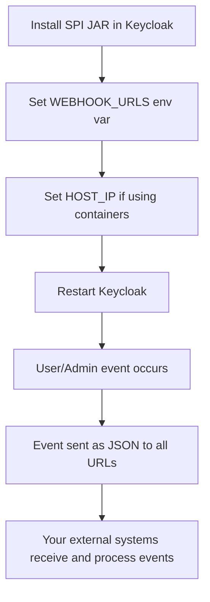

# Keycloak Webhook Bridge

[](https://opensource.org/licenses/MIT)
[](https://www.keycloak.org/)
[](https://openjdk.java.net/)
[](https://github.com/yourusername/keycloak-event-webhook)

A lightweight, production-ready Keycloak SPI extension that captures and forwards all Keycloak events (user logins, registrations, admin actions, etc.) to external systems via webhooks in real-time.

---

## 🔑 Key Features

- **Complete Event Coverage**: Captures ALL Keycloak events (user events and admin events)
- **Real-time Webhook Delivery**: Instantly forwards events as JSON payloads
- **Multiple Endpoint Support**: Send to multiple webhook URLs simultaneously
- **Zero Dependencies**: Uses Java's built-in HttpClient - no external libraries
- **Container-Ready**: Works seamlessly in Docker with special host resolution
- **Production Hardened**: Robust error handling, logging, and timeout management
- **Simple Configuration**: Just set environment variables - no UI configuration needed
- **Custom Event Type Field**: Distinguishes between user and admin events for easier processing
- **Comprehensive Test Coverage**: Thoroughly tested with JUnit 5 and Mockito

---

## Version History

### Version 1.0.0 (July 12, 2025)
- Initial stable release with production-ready features
- Enhanced documentation and Javadoc comments
- Improved error handling with WebhookMultiException for aggregating multiple failures
- Centralized configuration management with WebhookConfig
- Added support for host IP replacement in webhook URLs for container environments
- Improved JSON serialization with dedicated JsonUtil class
- Comprehensive unit test coverage

---

## Purpose
This project enables you to capture all Keycloak user and admin events and automatically send them as JSON payloads to any number of external endpoints (webhooks). It is useful for:
- Auditing and compliance
- Real-time user activity monitoring
- Integrating Keycloak with external systems (SIEM, analytics, custom apps)
- Triggering automations on identity events
- Building custom event processing pipelines

## Features
- **Listens to all Keycloak user and admin events**
- **Sends event data as JSON to one or more URLs** (webhooks)
- **Multiple webhook support**: Accepts a comma-separated list of URLs
- **Robust error handling and logging**
- **Configurable via environment variable or system property**
- **Container-friendly**: Supports Docker networking with HOST_IP configuration
- **No external dependencies**: Uses Java's built-in HttpClient
- **Tested with JUnit 5 & Mockito**

---

## Quick Start

### 1. Build the SPI
```sh
mvn clean package
```
This generates a JAR in `target/`.

### 2. Deploy to Keycloak
- Copy the JAR to your Keycloak server's `standalone/deployments/` (or `providers/` for Quarkus).
- Restart Keycloak.

### 3. Configure Webhook URLs
Set the webhook URLs as a comma-separated list:

- **Environment variable** (recommended for production):
  ```sh
  export WEBHOOK_URLS="https://example.com/webhook1,https://hooks.site/another"
  ```
- **Or system property** (for testing):
  ```sh
  -DWEBHOOK_URLS="https://example.com/webhook1,https://hooks.site/another"
  ```

### 4. Docker/Container Configuration
When running in containers, you may need to specify your host machine's IP to replace "localhost" in webhook URLs:

```sh
export HOST_IP="192.168.1.15"  # Replace with your actual host IP
```

This allows the container to properly reach services running on your host machine.

#### Finding Your HOST_IP on Different Operating Systems

##### macOS
```sh
# Option 1: For services that need to be accessed from Docker
ifconfig en0 | grep inet | grep -v inet6 | awk '{print $2}'

# Option 2: When using Docker Desktop
# You can use the special DNS name "host.docker.internal" instead of an IP address
export HOST_IP="host.docker.internal"
```

##### Linux (Ubuntu/Debian)
```sh
# Option 1: Find your IP on the default interface
ip addr show $(ip route | grep default | awk '{print $5}') | grep "inet " | awk '{print $2}' | cut -d/ -f1

# Option 2: Alternative method
hostname -I | awk '{print $1}'
```

##### Windows
```powershell
# Option 1: Using PowerShell
$env:HOST_IP = (Get-NetIPAddress -AddressFamily IPv4 -InterfaceAlias Ethernet).IPAddress
# or
$env:HOST_IP = (Get-NetIPAddress -AddressFamily IPv4 -InterfaceIndex $(Get-NetRoute | Where-Object DestinationPrefix -eq '0.0.0.0/0' | Select-Object -ExpandProperty InterfaceIndex)).IPAddress

# Option 2: When using Docker Desktop for Windows
# You can use the special DNS name "host.docker.internal" instead of an IP address
$env:HOST_IP = "host.docker.internal"
```

##### Docker Desktop (All Platforms)
If you're using Docker Desktop (on macOS, Windows, or Linux with WSL2), you can use the special DNS name that Docker Desktop provides:
```sh
export HOST_IP="host.docker.internal"
```

### 5. Docker Compose Example

Here's a minimal Docker Compose setup to get you started:

```yaml
services:
  postgres:
    image: postgres:16
    environment:
      POSTGRES_DB: keycloak
      POSTGRES_USER: postgres
      POSTGRES_PASSWORD: postgres
    ports:
      - "5432:5432"
    volumes:
      - postgres_data:/var/lib/postgresql/data
    networks:
      - keycloak_network

  keycloak:
    image: quay.io/keycloak/keycloak:26.0.0
    command: start
    depends_on:
      - postgres
    environment:
      KC_DB: postgres
      KC_DB_URL: jdbc:postgresql://postgres/keycloak
      KC_DB_USERNAME: postgres
      KC_DB_PASSWORD: postgres
      KC_HOSTNAME: localhost
      
      # Webhook configuration
      WEBHOOK_URLS: http://host.docker.internal:9001/v1/api/public/handle-event
      HOST_IP: host.docker.internal  # For Docker Desktop
      # HOST_IP: 192.168.1.15  # For Linux, use your actual host IP
    ports:
      - "8080:8080"
    networks:
      - keycloak_network
    volumes:
      - ./target:/opt/keycloak/providers  # Mount the webhook JAR

volumes:
  postgres_data:

networks:
  keycloak_network:
    driver: bridge
```

For Docker Desktop users, `host.docker.internal` resolves to the host machine. For Linux, use your actual host IP address.

### 6. What Happens?
Whenever a user or admin event occurs in Keycloak (login, registration, password reset, admin actions, etc.), the event is serialized to JSON and POSTed to each URL you configured.

---

## Example Event Payload
```json
{
  "eventType": "USER_EVENT",
  "event": {
    "type": "LOGIN",
    "userId": "...",
    "realmId": "...",
    "details": { ... },
    ...
  }
}
```

For admin events:
```json
{
  "eventType": "ADMIN_EVENT",
  "event": {
    "operationType": "CREATE",
    "resourcePath": "users/...",
    "realmId": "...",
    ...
  }
}
```

---

## Receiving Events in Your Application

Here's a simple Spring Boot controller example to receive the events:

```java
@PostMapping("/handle-event")
public ResponseEntity<String> handleEvent(@RequestBody String eventJson) {
    log.info("Received Keycloak event: {}", eventJson);
    
    try {
        ObjectMapper objectMapper = new ObjectMapper();
        Map<String, Object> wrapper = objectMapper.readValue(eventJson, Map.class);
        
        String eventType = (String) wrapper.get("eventType");
        Map<String, Object> event = (Map<String, Object>) wrapper.get("event");
        
        if ("USER_EVENT".equals(eventType)) {
            // Process user event
            log.info("User event: {}", event.get("type"));
        } else if ("ADMIN_EVENT".equals(eventType)) {
            // Process admin event
            log.info("Admin event: {}", event.get("operationType"));
        }
        
        return ResponseEntity.ok("Event processed successfully");
    } catch (Exception e) {
        log.error("Error processing event", e);
        return ResponseEntity.ok("Event received but processing failed");
    }
}
```

---

## Capturing Custom Events in Keycloak

This extension automatically captures all standard Keycloak events. If you need to capture custom events:

### 1. Creating Custom Events in Keycloak

You can emit custom events in Keycloak by using the EventStoreProvider:

```java
// In your Keycloak custom code
Event customEvent = new Event();
customEvent.setType(EventType.CUSTOM_REQUIRED_ACTION);  // Or define your own EventType
customEvent.setRealmId(realmId);
customEvent.setUserId(userId);
customEvent.setSessionId(sessionId);

// Add custom details
Map<String, String> details = new HashMap<>();
details.put("custom_field", "custom_value");
customEvent.setDetails(details);

// Emit the event
keycloakSession.getProvider(EventStoreProvider.class).onEvent(customEvent);
```

### 2. Processing Custom Events

When receiving events in your webhook handler, check for your custom event types:

```java
if ("USER_EVENT".equals(eventType)) {
    String eventTypeStr = (String) event.get("type");
    
    if ("CUSTOM_REQUIRED_ACTION".equals(eventTypeStr)) {
        // Handle your custom event
        Map<String, String> details = (Map<String, String>) event.get("details");
        String customField = details.get("custom_field");
        // Process custom event...
    }
}
```

### 3. Extending This SPI

If you need more advanced custom event handling, you can extend this SPI:

1. Fork this repository
2. Modify `KeycloakEventListenerProvider.java` to add custom processing
3. Build and deploy your custom version

---

## GUI / Usage Flow

Below is a simple flowchart to help you understand how and when to use this extension:



**When to use:**
- You want to integrate Keycloak with external systems in real time
- You need to monitor or audit user/admin activity
- You want to trigger workflows on identity events

**How to use:**
- Deploy the JAR, set the URLs, and you're done! No UI configuration needed.

---

## Advanced
- Supports multiple URLs (comma-separated)
- If any webhook fails, the error is logged and the exception is thrown
- All event payloads are sent as raw JSON with event type indicator
- Easily extensible for custom filtering or payloads
- Uses Java's built-in HttpClient for better compatibility with Keycloak's classloading

---

## Testing
Run all tests and check coverage:
```sh
mvn clean verify
```

## Troubleshooting

### Connection Issues in Containers
If you're running Keycloak in a container and can't connect to your webhook endpoints:

1. Make sure your webhook service is accessible from the container network
2. Set the `HOST_IP` environment variable to your host machine's IP address
3. Check the logs for detailed connection information
4. For Docker Desktop, you can try using `host.docker.internal` instead of localhost

### Webhook Receiver Not Getting Events
If your webhook receiver is running but not receiving events:

1. Check that your endpoint accepts POST requests with JSON body
2. Verify that your endpoint is accessible (try a manual curl request)
3. Look at the Keycloak logs for any connection errors
4. Make sure your webhook handler can parse the JSON format shown above

---

## 📚 Related Projects

- [Keycloak](https://github.com/keycloak/keycloak) - The main Keycloak project
- [Keycloak Documentation](https://www.keycloak.org/documentation) - Official Keycloak docs
- [Keycloak Event Listener SPI Docs](https://www.keycloak.org/docs/latest/server_development/#_events) - How to develop event listeners

---

## 📄 License

This project is licensed under the MIT License - see the LICENSE file for details.

---

## 🤝 Contributing

Contributions are welcome! Please feel free to submit a Pull Request.
